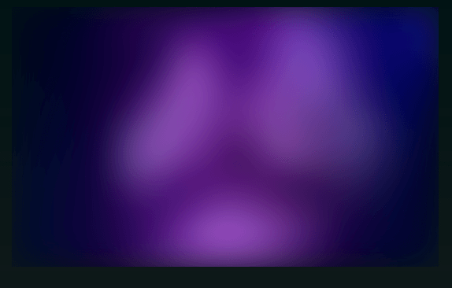

# Rehype Image Placeholder

**Markdown** plugin for [Rehype](https://github.com/rehypejs/rehype) that gets the **image size** and **Base64 placeholder** from **local images**.



## Install

```shell
npm i rehype-image-placeholder
```

## Motivation

I made this plugin because I couldn't get [rehype-img-size](https://github.com/ksoichiro/rehype-img-size) to work with [XDM](https://github.com/wooorm/xdm) and I wanted to get the **image size** and a **placeholder** to be used with [next/image](https://nextjs.org/docs/api-reference/next/image) for [Next.js](https://nextjs.org/).

I tried to make it work for most use cases where you're using a **local image** but keep in mind it's meant to be used with **Next.js**.

If you want to tweak it to your needs I made the code easy to understand, so you can change and include it as a file in your project or create your own **npm** package if you want.

## Use

```shell
import rehypeImagePlaceholder from 'rehype-image-placeholder'
```

Then pass the plugin wherever you pass your **rehype** plugins.

```tsx
// markdown plugins
const options: BundleMDXOptions = {
  xdmOptions(options) {
    options.rehypePlugins = [
      // image dimensions and placeholder
      [rehypeImagePlaceholder, { dir: 'public' }],
    ]
    return options
  },
}
```

If you have an image inside your **Markdown** file you can get the **image size** and **placeholder** from it.

```terminal

```

```html

```

These props are then passed to your `<Image />` component that replaces the one in your **Markdown**.

```tsx
function Image({ src, alt, width, height, blurDataURL }) {
  return (
    <NextImage
      src={src}
      alt={alt}
      width={width}
      height={height}
      loading="lazy"
      placeholder="blur"
      blurDataURL={blurDataURL}
    />
  )
}
```

You can have a look at a [Next.js Markdown blog](https://github.com/mattcroat/digital-garden) as an example.
